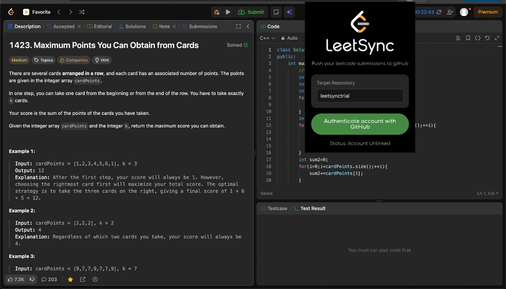
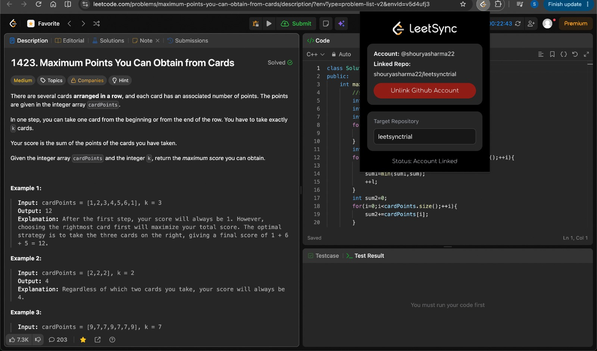
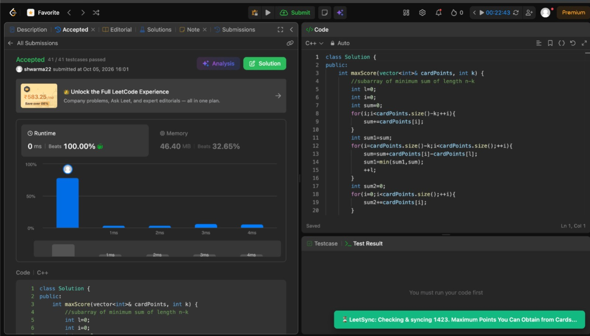
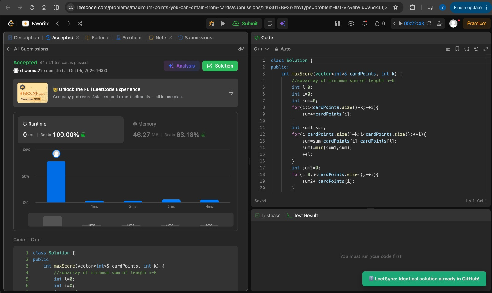

# ⚡ LeetSync

**Automatically sync your Accepted LeetCode submissions to GitHub — complete with problem descriptions, performance metrics, and a live global stats dashboard.**


---

## 📖 Table of Contents
- [Overview](#-overview)
- [Screenshots (Working Examples)](#-screenshots-working-examples)
- [Key Features](#-key-features)
- [System Architecture](#️-system-architecture)
- [Generated Repository Structure](#-generated-repository-structure)
- [Getting Started (Install on Your PC)](#-getting-started-install-on-your-pc)
  - [Option 1: Instant Install (Pre-Built ZIP — No Coding Required)](#option-1-instant-install-pre-built-zip--no-coding-required)
  - [Option 2: Clone & Build from Source (For Developers & Evaluators)](#option-2-clone--build-from-source-for-developers--evaluators)
- [How to Use LeetSync](#-how-to-use-leetsync)
- [Supported Languages](#-supported-languages)
- [Project Folder Structure](#️-project-folder-structure)
- [Troubleshooting](#-troubleshooting)

---

## 📖 Overview

**LeetSync** is a Manifest V3 Chrome Extension that connects your LeetCode practice workflow directly to your GitHub portfolio. The moment your solution passes all test cases on LeetCode, LeetSync verifies the submission via LeetCode's GraphQL API, formats your code with execution benchmarks (`Runtime` & `Memory` percentiles), generates a problem `README.md`, and commits everything to your target GitHub repository automatically—with zero backend servers required.

---

## 📸 Screenshots (Working Examples)

### 1. Extension Popup — Unlinked State


### 2. Extension Popup — Linked to GitHub Repository


### 3. Live LeetCode Syncing Notification on Accepted Submission


### 4. Smart Deduplication Check (Skipping Identical Solutions)


---

## ✨ Key Features

- **🔐 GitHub OAuth 2.0 Authentication:** Logs in directly via `chrome.identity.launchWebAuthFlow` with `repo` scope (supports both public and private repositories).
- **🚨 Live `401` Token Revocation Detection:** Validates your token against `GET https://api.github.com/user` on popup open and before every push. If revoked or expired, stale credentials are wiped and a red `!` badge alerts you on the extension toolbar icon.
- **📁 Auto-Repository Creation:** Automatically creates your target GitHub repository via `POST /user/repos` if it does not exist yet.
- **🛡️ Anti-Spoofing & GraphQL Code Extraction:** Bypasses Monaco Editor DOM virtualization truncation by querying LeetCode's `/graphql` API directly for full source code and verifying that the submission timestamp is `< 60 seconds` old.
- **🔄 Background Tab-Closure Resilience:** If you click **Submit** and close the LeetCode tab before evaluation finishes, the background Service Worker takes over polling and pushes the solution once accepted.
- **🧠 Smart Deduplication & SHA Version Control:** Strips the 4-line dynamic performance header and compares raw code before pushing. Identical code is skipped to prevent commit spam; updated/optimized code overwrites the existing file cleanly using its Git `sha`.
- **📊 Global README Dashboard:** Automatically maintains a root `README.md` in your solutions repository with a total solved counter and a numerically sorted list of every problem you have solved alongside its Runtime and Memory stats.

---

## 🏗️ System Architecture

```text
┌─────────────────────────────────────────────────────────────────────────┐
│                        LEETCODE TAB (Content Script)                    │
│  1. Captures user submit intent (Submit Click / Ctrl+Enter)             │
│  2. Observes DOM for "Accepted" banner via MutationObserver             │
│  3. Queries LeetCode GraphQL API for full raw code, runtime, & memory   │
└───────────────────────────────────┬─────────────────────────────────────┘
                                    │ chrome.runtime.sendMessage
                                    ▼
┌─────────────────────────────────────────────────────────────────────────┐
│                  BACKGROUND SERVICE WORKER (Manifest V3)                │
│  1. Handles GitHub OAuth 2.0 WebAuthFlow & token exchange               │
│  2. Ensures target repo exists (GET /repos -> POST /user/repos)         │
│  3. Checks existing file SHA & strips header for duplicate comparison   │
│  4. UTF-8 Base64 encodes & commits README.md + solution.<ext>           │
│  5. Fallback background polling if LeetCode tab closes mid-evaluation   │
└───────────────────────────────────┬─────────────────────────────────────┘
                                    │ chrome.storage.local
                                    ▼
┌─────────────────────────────────────────────────────────────────────────┐
│                        REACT + TYPESCRIPT POPUP UI                      │
│  1. Optimistic state rendering (zero unlinked UI flash on open)         │
│  2. Real-time GitHub token verification & 401 error badge handling      │
│  3. Instant target repository switching                                 │
└─────────────────────────────────────────────────────────────────────────┘
```

---

## 📂 Generated Repository Structure

LeetSync organizes your target GitHub repository into clean, zero-padded problem folders:

```text
my-leetcode-solutions/
├── README.md                        # Global Stats & Sorted Problem Index
├── 0001-two-sum/
│   ├── README.md                    # Full Problem Description & Difficulty
│   └── solution.cpp                 # Solution Code + Performance Header
├── 0015-3sum/
│   ├── README.md
│   └── solution.cpp
└── 0930-binary-subarrays-with-sum/
    ├── README.md
    └── solution.cpp
```

**Sample Solution File (`solution.cpp`):**
```cpp
// Problem: 930. Binary Subarrays With Sum (Medium)
// URL: [https://leetcode.com/problems/binary-subarrays-with-sum/](https://leetcode.com/problems/binary-subarrays-with-sum/)
// Runtime: 4 ms (Beats 46.09%)
// Memory: 32.62 MB (Beats 62.09%)

class Solution {
public:
    int numSubarraysWithSum(vector<int>& nums, int goal) {
        // ...
    }
};
```

---

## 🚀 Getting Started (Install on Your PC)

You can install LeetSync on your computer in **two ways**:
1. **Option 1 (Fastest):** Download the pre-built `.zip` from Releases and load it directly into Chrome.
2. **Option 2 (Developer Setup):** Clone the repository, add your `.env` keys, and build it from source on your PC.

---

### Option 1: Instant Install (Pre-Built ZIP — No Coding Required)

1. Go to the [**Releases**](https://github.com/shouryasharma22/leetsync/releases) section on the right sidebar of this GitHub repository.
2. Download **`LeetSync-v1.0.0.zip`** from the latest release and **extract (unzip)** it to a folder on your computer.
3. Open Google Chrome (or Brave / Edge) and type this into your address bar:
   ```text
   chrome://extensions
   ```
4. Turn **ON** the **Developer mode** toggle in the top-right corner.
5. Click the **Load unpacked** button in the top-left corner.
6. Select the unzipped folder (the folder that contains `manifest.json`).
7. Click the puzzle-piece **Extensions** icon in your Chrome toolbar, pin **LeetSync**, and click **Authenticate account with GitHub**!

---

### Option 2: Clone & Build from Source (For Developers & Evaluators)

#### Prerequisites
Make sure you have the following installed on your PC:
- **Node.js** (v18.0.0 or higher) & **npm** — [Download Node.js](https://nodejs.org/)
- **Git** — [Download Git](https://git-scm.com/)
- **Google Chrome** (or any Chromium-based browser)

#### Step 1: Clone the Repository to Your PC
Open your terminal (or Command Prompt / PowerShell) and run:
```bash
git clone [https://github.com/shouryasharma22/leetsync.git](https://github.com/shouryasharma22/leetsync.git)
cd leetsync/client
```

#### Step 2: Install Dependencies
Install all required React, TypeScript, and Vite packages inside the `client` directory:
```bash
npm install
```

#### Step 3: Create a GitHub OAuth App (Or Use Provided Test Credentials)
To run a custom build with your own GitHub OAuth credentials:
1. Go to **GitHub** $\rightarrow$ **Settings** $\rightarrow$ **Developer settings** $\rightarrow$ **OAuth Apps** $\rightarrow$ **New OAuth App**.
2. Fill in the details:
   * **Application name:** `LeetSync`
   * **Homepage URL:** `https://nembacmamcnbhofiakooecbjjhjlljip.chromiumapp.org/`
   * **Redirect URI (Authorization callback URL):**
     ```text
     [https://nembacmamcnbhofiakooecbjjhjlljip.chromiumapp.org/](https://nembacmamcnbhofiakooecbjjhjlljip.chromiumapp.org/)
     ```
     *(Note: Because `client/public/manifest.json` contains a locked public `"key"`, Chrome assigns this exact extension ID `nembacmamcnbhofiakooecbjjhjlljip` on every PC!)*
3. Click **Register application**, copy your **Client ID**, and click **Generate a new client secret** to copy your **Client Secret**.

#### Step 4: Create Your `.env` File
Inside the **`client/`** folder (`leetsync/client/.env`), create a file named **`.env`** and paste your GitHub OAuth credentials:
```env
VITE_GITHUB_CLIENT_ID=your_github_client_id_here
VITE_GITHUB_CLIENT_SECRET=your_github_client_secret_here
```

#### Step 5: Build the Extension
Compile the TypeScript & React popup and bundle the extension into `client/dist/`:
```bash
npm run build
```
Once finished, a **`dist/`** folder will be generated inside `client/`.

#### Step 6: Load the Built Extension into Chrome
1. Open Google Chrome and navigate to:
   ```text
   chrome://extensions
   ```
2. Toggle **Developer mode** ON in the top-right corner.
3. Click **Load unpacked** in the top-left corner.
4. Navigate to your cloned project and select the **`leetsync/client/dist`** folder.
5. **LeetSync** is now installed on your PC! *(Whenever you make changes to the code, simply run `npm run build` in `client/` and click the **Reload `↻`** icon on the LeetSync card in `chrome://extensions`).*

---

## 🎮 How to Use LeetSync

1. **Click the LeetSync icon** in your Chrome toolbar to open the popup.
2. **Set your Target Repository:** Type the name of the GitHub repository where you want your solutions saved (defaults to `my-leetcode-solutions`). You can change this anytime.
3. **Authenticate:** Click **Authenticate account with GitHub** and authorize the app. The popup will display your `@username` and linked repository (`username/repo-name`).
4. **Solve on LeetCode:** Open any problem on [leetcode.com/problems/...](https://leetcode.com/problemset/) and click **Submit** (or press `Ctrl + Enter` / `Cmd + Enter`).
5. **Automatic Sync:** Once your solution is **Accepted**, a green toast notification will appear in the bottom-right corner of LeetCode:
   * `⏳ LeetSync: Checking & syncing 0001. Two Sum...`
   * `✅ Successfully pushed to GitHub!` (or `ℹ️ Identical solution already in GitHub!` if unchanged).

---

## 🧪 Supported Languages

LeetSync automatically maps LeetCode language slugs to their proper file extensions and comment styles (`//` vs `#`):

| Language | File Produced | Header Comment Style |
| :--- | :--- | :--- |
| **C++** | `solution.cpp` | `//` |
| **Java** | `solution.java` | `//` |
| **Python / Python3** | `solution.py` | `#` |
| **C** | `solution.c` | `//` |
| **C#** | `solution.cs` | `//` |
| **JavaScript** | `solution.js` | `//` |
| **TypeScript** | `solution.ts` | `//` |
| **Go / Rust / Kotlin / Swift** | `solution.go` / `.rs` / `.kt` / `.swift` | `//` |
| **Ruby** | `solution.rb` | `#` |
| **MySQL / PostgreSQL / MS SQL / Oracle** | `solution.sql` | `#` |

---

## 🛠️ Project Folder Structure

```text
leetsync/
├── README.md                    # Project Documentation
└── client/                      # Extension Frontend & Background Workers
    ├── public/
    │   ├── manifest.json        # Manifest V3 config, permissions, & locked key
    │   ├── service-worker.js    # Background OAuth, GitHub API & fallback poller
    │   ├── content-script.js    # LeetCode DOM observer, GraphQL fetcher & toast UI
    │   ├── logo.png             # Extension icon
    │   └── wordmark.png         # Popup brand wordmark
    ├── src/
    │   ├── App.tsx              # Popup React UI, storage sync & 401 token check
    │   ├── App.css              # Dark-mode popup styling
    │   └── main.tsx             # React DOM entry point
    ├── .env                     # Local GitHub OAuth secrets (git-ignored)
    ├── .gitignore               # Ignores node_modules, dist, .env, *.pem, *.crx
    ├── package.json             # Build scripts & dependencies
    └── vite.config.ts           # Vite bundler configuration
```

---

## 🔧 Troubleshooting

- **`Service worker registration failed` or changes not showing up:**
  Make sure you ran `npm run build` inside the `client/` directory and selected **`client/dist`** (not `client/` or `client/public/`) when clicking **Load unpacked** in `chrome://extensions`.
- **Red `!` Badge on the Extension Icon:**
  Your GitHub OAuth token was revoked or expired (`401 Unauthorized`). Open the LeetSync popup and click **Authenticate account with GitHub** to generate a fresh session.
- **No Toast Appears After Clicking Submit on LeetCode:**
  Refresh your LeetCode tab once after installing or reloading the extension so Chrome injects the latest `content-script.js` into the page.
